# Sistema de Gestión Vivero Da Vinci

## Resumen

**Vivero Da Vinci** es una aplicación web full-stack diseñada para digitalizar y optimizar las operaciones de un vivero. El sistema permite gestionar empleados, clientes, productos con imágenes, categorías y ventas con control de stock.

## Requisitos, Instalación e Inicialización de la App

### Requisitos del Sistema

- **Node.js**: v22.14.0 o superior
- **npm**: v10.9.2 o superior
- **MySQL**: v8.0 o superior

Verificar versiones instaladas:

```bash
node -v
npm -v
mysql --version
```

### Variables de Entorno: Backend (.env)

- `PORT`: Puerto del servidor (default: 3000)
- `JWT_SECRET`: Clave secreta para firmar tokens JWT
- `NODE_ENV`: Entorno de ejecución: development / production
- `DB_HOST`: Host de la base de datos
- `DB_USER`: Usuario de la base de datos
- `DB_PASSWORD`: Contraseña de la base de datos
- `DB_NAME`: Nombre de la base de datos
- `DB_PORT`: Puerto de la base de datos

### Variables de Entorno: Frontend (.env)

- `VITE_URL`: URL del backend

### Instalación

```bash
# Clonar y acceder al Repositorio
git clone https://github.com/AgUsBF-DV/final-pd-acn4bv-beceyro.git
cd final-pd-acn4bv-beceyro

# Instalar dependencias del backend
cd backend
npm install

# Crear archivo de variables de entorno (las variables base ya
# están configuradas para prueba local, de lo contrario editarlas)
cp .env.example .env

# Definir el entorno de trabajo en el .env
# NODE_ENV=production (ya configurado por defecto)
# NODE_ENV=development

# Instalar dependencias del frontend
cd ../frontend
npm install

# Crear archivo de variables de entorno (las variables base ya
# están configuradas para prueba local, de lo contrario editarlas)
cp .env.example .env

# Si el backend se configuró en modo producción (por defecto), se
# debe compilar el frontend, de lo contrario omitir este paso
npm run build
```

La base de datos debe configurarse con el script [`create_db.sql`](./database/create_db.sql), y se pueden cargar datos de prueba con [`test_data.sql`](./database/test_data.sql).

> [!NOTE]  
> Las imágenes de productos de prueba no se trackean con Git, deben ser cargadas por separado u ignoradas para probar el sistema.

### Ejecución

#### Entorno de producción

```bash
cd backend
npm start
```

La aplicación completa estará disponible en: `http://localhost:3000`

#### Entorno de desarrollo

```bash
# Iniciar backend en una terminal
cd backend
npm run dev

# Iniciar el frontend en otra terminal
cd frontend
npm run dev
```

El backend estará disponible en: `http://localhost:3000` y el frontend normalmente en `http://localhost:5174`, pero se debe confirmar con el mensaje de la terminal que indica dónde se encuentra.

#### Credenciales de Prueba

Después de cargar `test_data.sql`:

| Rol       | Email           | Password |
| --------- | --------------- | -------- |
| Admin     | `admin@dv.com`  | 1234     |
| Encargado | `charly@dv.com` | 1234     |
| Empleado  | `fito@dv.com`   | 1234     |

## Estructura del Proyecto

### Vista General

```bash
final-pd-acn4bv-beceyro/
├── backend/                    # Servidor Node.js + Express
├── frontend/                   # Aplicación React
├── docs/                       # Documentación técnica
│   ├── database/               # Scripts SQL
│   │   ├── create_db.sql       # Script de creación de BD
│   │   └── test_data.sql       # Datos de prueba
│   └── informe.md              # Este documento
├── LICENSE                     # GNU GPL v3
└── README.md                   # Documentación básica
```

### Backend (Arquitectura MVC)

```bash
backend/
├── controllers/                # Lógica
│   ├── authController.js       # Login y autenticación
│   ├── categoriaController.js  # CRUD categorías
│   ├── clienteController.js    # CRUD clientes
│   ├── empleadoController.js   # CRUD empleados
│   ├── productoController.js   # CRUD productos con imágenes
│   └── ventaController.js      # CRUD ventas con stock
│
├── middleware/                 # Middlewares personalizados
│   ├── authMiddleware.js       # Verificación JWT
│   ├── errorHandler.js         # Manejo centralizado de errores
│   ├── logger.js               # Logger de peticiones HTTP
│   └── validator.js            # Validación de datos
│
├── models/                     # Modelos de datos con Knex
│   ├── Categoria.js
│   ├── Cliente.js
│   ├── Empleado.js
│   ├── Producto.js
│   └── Venta.js
│
├── routes/                     # Definición de endpoints
│   ├── authRoutes.js
│   ├── categoriaRoutes.js
│   ├── clienteRoutes.js
│   ├── empleadoRoutes.js
│   ├── productoRoutes.js
│   └── ventaRoutes.js
│
├── scripts/                    # Scripts de utilidad
│
├── uploads/                    # Temporal para multer
│
├── utils/                      # Utilidades
│   ├── AppError.js             # Clase de error personalizada
│   ├── catchAsync.js           # Wrapper para async/await
│   ├── database.js             # Configuración de Knex
│   └── fileHandler.js          # Manejo de archivos
│
├── .env                        # Variables de entorno
└── index.js                    # Punto de entrada del servidor
```

### Frontend

```bash
frontend/
├── public/
│   ├── img/
│   │   └── productos/            # Imágenes de productos
│   └── favicon.png
│
├── src/
│   ├── components/               # Componentes reutilizables
│   │   ├── Button.jsx            # Botones personalizados
│   │   ├── Card.jsx              # Tarjetas de contenido
│   │   ├── Footer.jsx            # Footer de la app
│   │   ├── Form.jsx              # Formularios dinámicos
│   │   ├── Navbar.jsx            # Barra de navegación
│   │   └── Table.jsx             # Tablas con datos
│   │
│   ├── context/                  # Context API
│   │   └── UserContext.jsx       # Estado global de usuario
│   │
│   ├── pages/                    # Páginas/vistas principales
│   │   ├── Categorias.jsx        # Gestión de categorías
│   │   ├── Clientes.jsx          # Gestión de clientes
│   │   ├── Empleados.jsx         # Gestión de empleados
│   │   ├── Home.jsx              # Dashboard principal
│   │   ├── Login.jsx             # Página de login
│   │   ├── ProductoDetalle.jsx   # Vista detallada de producto
│   │   ├── Productos.jsx         # Catálogo de productos
│   │   ├── VentaDetalle.jsx      # Vista detallada de venta
│   │   └── Ventas.jsx            # Historial de ventas
│   │
│   ├── services/                 # Servicios externos
│   │   └── api.js                # Configuración de Axios
│   │
│   ├── App.css                   # Estilos globales
│   ├── App.jsx                   # Configuración de rutas
│   ├── index.css                 # Estilos base y Tailwind
│   └── main.jsx                  # Punto de entrada React
│
├── .env                          # Variables de entorno
├── eslint.config.js              # Configuración ESLint
├── index.html                    # HTML base
├── postcss.config.js             # Configuración PostCSS
└── vite.config.js                # Configuración Vite
```

## Modelado de Datos

### Modelo Entidad-Relación

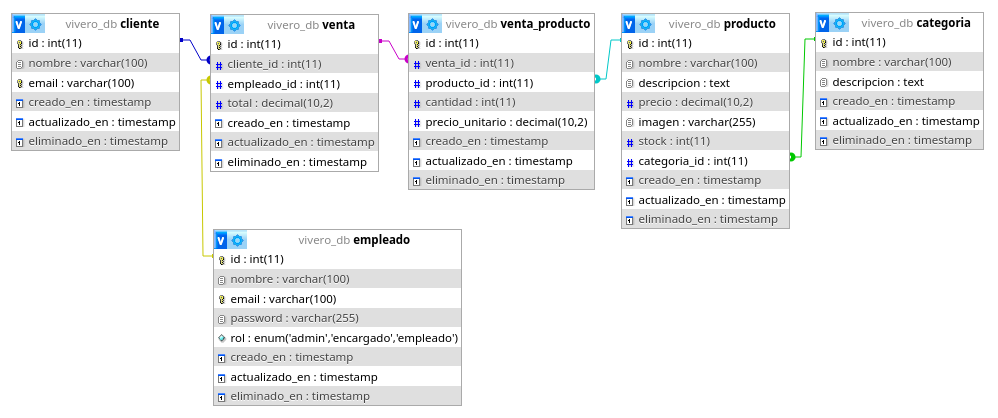

### Tabla empleado

| Campo          | Tipo                                 | Descripción                        |
| -------------- | ------------------------------------ | ---------------------------------- |
| id             | INT AUTO_INCREMENT                   | Identificador único                |
| nombre         | VARCHAR(100)                         | Nombre completo                    |
| email          | VARCHAR(100) UNIQUE                  | Email (usado para login)           |
| password       | VARCHAR(255)                         | Contraseña hasheada (bcrypt)       |
| rol            | ENUM('admin','encargado','empleado') | Rol del usuario                    |
| creado_en      | TIMESTAMP                            | Fecha de creación                  |
| actualizado_en | TIMESTAMP                            | Fecha de última actualización      |
| eliminado_en   | TIMESTAMP NULL                       | Fecha de eliminación (soft delete) |

### Tabla cliente

| Campo          | Tipo                | Descripción                        |
| -------------- | ------------------- | ---------------------------------- |
| id             | INT AUTO_INCREMENT  | Identificador único                |
| nombre         | VARCHAR(100)        | Nombre completo                    |
| email          | VARCHAR(100) UNIQUE | Email del cliente                  |
| creado_en      | TIMESTAMP           | Fecha de creación                  |
| actualizado_en | TIMESTAMP           | Fecha de última actualización      |
| eliminado_en   | TIMESTAMP NULL      | Fecha de eliminación (soft delete) |

### Tabla categoria

| Campo          | Tipo               | Descripción                        |
| -------------- | ------------------ | ---------------------------------- |
| id             | INT AUTO_INCREMENT | Identificador único                |
| nombre         | VARCHAR(100)       | Nombre de la categoría             |
| descripcion    | TEXT               | Descripción de la categoría        |
| creado_en      | TIMESTAMP          | Fecha de creación                  |
| actualizado_en | TIMESTAMP          | Fecha de última actualización      |
| eliminado_en   | TIMESTAMP NULL     | Fecha de eliminación (soft delete) |

### Tabla producto

| Campo          | Tipo               | Descripción                            |
| -------------- | ------------------ | -------------------------------------- |
| id             | INT AUTO_INCREMENT | Identificador único                    |
| nombre         | VARCHAR(100)       | Nombre del producto                    |
| descripcion    | TEXT               | Descripción del producto               |
| precio         | DECIMAL(10,2)      | Precio unitario                        |
| imagen         | VARCHAR(255)       | Ruta de la imagen (/img/productos/...) |
| stock          | INT                | Cantidad disponible                    |
| categoria_id   | INT FK             | Referencia a categoria                 |
| creado_en      | TIMESTAMP          | Fecha de creación                      |
| actualizado_en | TIMESTAMP          | Fecha de última actualización          |
| eliminado_en   | TIMESTAMP NULL     | Fecha de eliminación (soft delete)     |

### Tabla venta

| Campo          | Tipo               | Descripción                                |
| -------------- | ------------------ | ------------------------------------------ |
| id             | INT AUTO_INCREMENT | Identificador único                        |
| cliente_id     | INT FK             | Referencia a cliente                       |
| empleado_id    | INT FK             | Referencia a empleado que realizó la venta |
| total          | DECIMAL(10,2)      | Monto total de la venta                    |
| creado_en      | TIMESTAMP          | Fecha de creación                          |
| actualizado_en | TIMESTAMP          | Fecha de última actualización              |
| eliminado_en   | TIMESTAMP NULL     | Fecha de eliminación (soft delete)         |

### Tabla venta_producto

| Campo           | Tipo               | Descripción                        |
| --------------- | ------------------ | ---------------------------------- |
| id              | INT AUTO_INCREMENT | Identificador único                |
| venta_id        | INT FK             | Referencia a venta                 |
| producto_id     | INT FK             | Referencia a producto              |
| cantidad        | INT                | Cantidad vendida                   |
| precio_unitario | DECIMAL(10,2)      | Precio al momento de la venta      |
| creado_en       | TIMESTAMP          | Fecha de creación                  |
| actualizado_en  | TIMESTAMP          | Fecha de última actualización      |
| eliminado_en    | TIMESTAMP NULL     | Fecha de eliminación (soft delete) |

### Características Adicionales

- **Soft Delete**: Todas las tablas tienen el campo `eliminado_en` que permite "eliminar" registros sin borrarlos físicamente
- **Timestamps Automáticos**: `creado_en` se establece al crear, `actualizado_en` se actualiza automáticamente
- **Foreign Keys**: Garantizan integridad referencial con `ON DELETE CASCADE`
- **Transacciones**: Las ventas se crean con transacciones para garantizar consistencia en el descuento de stock

## Flujos de Uso de la App

### Flujo de ventas

1. Ingreso al sistema mediante el control de acceso
2. Acceder al módulo de ventas
3. Seleccionar cliente (o usar un cliente por defecto)
4. Agregar productos al carrito
5. Seleccionar cantidad por producto
6. Validar stock disponible
7. Mostrar subtotales por producto y total general
8. Repetir pasos 4-6 por cada producto adicional a cargar
9. Confirmar la venta
10. Registrar la venta en la base de datos
11. Descontar automáticamente el stock correspondiente

### Flujo de gestión de registros (ABM/CRUD)

1. Ingreso al sistema mediante el control de acceso
2. Acceder al módulo correspondiente (cliente/empleado/categoría/producto)
3. Visualizar tabla con listado de registros existentes
4. Seleccionar acción:
   - Botón "Nuevo" para dar de alta
   - Botón "Editar" para modificar registro existente
   - Botón "Eliminar" para borrar registro
5. Completar los datos del formulario correspondiente
6. Validar campos requeridos y formato de datos
7. Confirmar la operación
8. Registrar la operación en la base de datos
9. Actualizar la tabla con los cambios realizados

### Flujo para editar información personal (a desarrollar)

1. Ingreso al sistema mediante el control de acceso
2. Acceder a la sección de información personal (perfil de usuario)
3. Visualizar formulario con los datos actuales del empleado
4. Editar los campos que se deseen modificar
5. Validar los datos ingresados
6. Confirmar la operación
7. Registrar la actualización en la base de datos
8. Mostrar mensaje de confirmación

### Flujo para generación de reportes de ventas (a desarrollar)

1. Ingreso al sistema mediante el control de acceso
2. Acceder al módulo de reportes
3. Visualizar tabla con registros de ventas
4. Aplicar filtros disponibles:
   - Por rango de fechas
   - Por cliente
   - Por empleado
   - Por producto
5. Visualizar resultados filtrados
6. (Opcional) Exportar o imprimir reporte

## API: Endpoints y Ejemplos

### Flujo de una Petición HTTP

1. Usuario interactúa con la interfaz (React)
2. Componente React llama a servicio (api.js con Axios)
3. Axios envía petición HTTP con JWT en header
4. Express recibe la petición
5. Middleware: `logger.js` > `authMiddleware.js` > `validator.js`
6. Router direcciona a controlador correspondiente
7. Controlador ejecuta lógica de negocio
8. Modelo consulta/modifica la base de datos (Knex → MySQL)
9. Base de datos retorna resultados
10. Controlador formatea respuesta JSON
11. Middleware `errorHandler.js` captura errores (si existen)
12. Express envía respuesta HTTP al cliente
13. Axios recibe respuesta
14. React actualiza el estado y re-renderiza componentes
15. Usuario ve resultados en la interfaz

### Endpoints: Autenticación

- `POST /auth/login` - Iniciar sesión (público)

### Endpoints: Categorías (requiere JWT)

- `GET /api/categorias` - Listar todas las categorías
- `GET /api/categorias/:id` - Obtener categoría por ID
- `POST /api/categorias` - Crear nueva categoría
- `PUT /api/categorias/:id` - Actualizar categoría
- `DELETE /api/categorias/:id` - Eliminar categoría (soft delete)

### Endpoints: Clientes (requiere JWT)

- `GET /api/clientes` - Listar todos los clientes
- `GET /api/clientes/:id` - Obtener cliente por ID
- `POST /api/clientes` - Crear nuevo cliente
- `PUT /api/clientes/:id` - Actualizar cliente
- `DELETE /api/clientes/:id` - Eliminar cliente (soft delete)

### Endpoints: Empleados (requiere JWT)

- `GET /api/empleados` - Listar todos los empleados
- `GET /api/empleados/:id` - Obtener empleado por ID
- `POST /api/empleados` - Crear nuevo empleado
- `PUT /api/empleados/:id` - Actualizar empleado
- `DELETE /api/empleados/:id` - Eliminar empleado (soft delete)

### Endpoints: Productos (requiere JWT)

- `GET /api/productos` - Listar todos los productos
- `GET /api/productos/:id` - Obtener producto por ID
- `POST /api/productos` - Crear producto
- `PUT /api/productos/:id` - Actualizar producto
- `DELETE /api/productos/:id` - Eliminar producto (soft delete)

### Endpoints: Ventas (requiere JWT)

- `GET /api/ventas` - Listar todas las ventas
- `GET /api/ventas/:id` - Obtener venta con detalle de productos
- `POST /api/ventas` - Crear nueva venta (descuenta stock)
- `DELETE /api/ventas/:id` - Eliminar venta (soft delete)

### Ejemplo: Autenticación

#### Request por POST a /auth/login

```json
{
  "email": "admin@dv.com",
  "password": "1234"
}
```

#### Response (200 OK)

```json
{
  "token": "eyJhbGciOiJIUzI1NiIsInR5cCI6IkpXVCJ9...",
  "user": {
    "id": 1,
    "nombre": "Administrador",
    "email": "admin@dv.com",
    "rol": "admin"
  }
}
```

#### Response (400 Bad Request)

```json
{
  "success": false,
  "message": "Credenciales inválidas"
}
```

### Ejemplo: Productos

#### Response (200 OK) al Request GET /api/productos

```json
[
  {
    "id": 1,
    "nombre": "Ficus Benjamina",
    "descripcion": "Árbol ornamental de interior",
    "precio": "1500.00",
    "imagen": "/img/productos/producto_1.jpg",
    "stock": 15,
    "categoria_id": 2,
    "categoria_nombre": "Plantas de Interior",
    "creado_en": "2024-12-01T10:30:00.000Z",
    "actualizado_en": "2024-12-05T14:20:00.000Z"
  },
  {
    "id": 2,
    "nombre": "Rosa Roja",
    "descripcion": "Rosal con flores rojas intensas",
    "precio": "800.00",
    "imagen": "/img/productos/producto_2.jpg",
    "stock": 30,
    "categoria_id": 1,
    "categoria_nombre": "Flores",
    "creado_en": "2024-12-02T09:15:00.000Z",
    "actualizado_en": "2024-12-02T09:15:00.000Z"
  }
  .
  ..
  ...
]
```

### Ejemplo Ventas

#### Response (200 OK) al Request GET /api/ventas

```json
[
  {
    "id": 1,
    "cliente_id": 3,
    "cliente_nombre": "María González",
    "empleado_id": 2,
    "empleado_nombre": "Carlos Empleado",
    "total": "3800.00",
    "creado_en": "2024-12-07T11:30:00.000Z"
  },
  {
    "id": 2,
    "cliente_id": 5,
    "cliente_nombre": "Juan Pérez",
    "empleado_id": 1,
    "empleado_nombre": "Admin Da Vinci",
    "total": "2400.00",
    "creado_en": "2024-12-07T15:45:00.000Z"
  }
  .
  ..
  ...
]
```

#### Response (200 OK) al Request GET /api/ventas:id

```json
{
  "id": 1,
  "cliente_id": 3,
  "cliente_nombre": "María González",
  "cliente_email": "maria@email.com",
  "empleado_id": 2,
  "empleado_nombre": "Carlos Empleado",
  "total": "3800.00",
  "creado_en": "2024-12-07T11:30:00.000Z",
  "productos": [
    {
      "producto_id": 1,
      "producto_nombre": "Ficus Benjamina",
      "cantidad": 2,
      "precio_unitario": "1500.00",
      "subtotal": "3000.00"
    },
    {
      "producto_id": 2,
      "producto_nombre": "Rosa Roja",
      "cantidad": 1,
      "precio_unitario": "800.00",
      "subtotal": "800.00"
    }
  ]
}
```

#### Request por POST a /api/ventas

```json
{
  "cliente_id": 7,
  "productos": [
    {
      "producto_id": 5,
      "cantidad": 3,
      "precio_unitario": 1200
    },
    {
      "producto_id": 8,
      "cantidad": 1,
      "precio_unitario": 2500
    }
  ]
}
```

#### Response (200 OK) al POST a /api/ventas

```json
{
  "id": 3,
  "cliente_id": 7,
  "empleado_id": 1,
  "total": "6100.00",
  "creado_en": "2024-12-08T17:30:00.000Z",
  "productos": [
    {
      "producto_id": 5,
      "cantidad": 3,
      "precio_unitario": "1200.00",
      "subtotal": "3600.00"
    },
    {
      "producto_id": 8,
      "cantidad": 1,
      "precio_unitario": "2500.00",
      "subtotal": "2500.00"
    }
  ]
}
```

## Seguridad

- Gestión de Contraseñas
  - Hasheadas con bcrypt con 10 salt rounds
  - Solo se guarda el hash en la base de datos
  - La verificación en el login se realiza con `bcrypt.compare()`
- JWT (JSON Web Tokens)
  - Al hacer login exitoso, se genera un token firmado con `JWT_SECRET`
  - El frontend guarda el token en `localStorage`
  - En cada request se incluye el token en el header
  - `authMiddleware` valida el token en cada petición protegida
  - El token expira en 1 hora
- Si se hace una petición con el token vencido, automáticamente se desloguea al usuario
- Middleware de autenticación protege rutas de la API (excepto `/auth/login`)
- El componente `PrivateRoute` protege rutas de React
- El módulo Knex usa prepared statements, queries parametrizados e inputs sanitizados antes de llegar a la base de datos

### Mejoras de Seguridad Futuras

- **HTTPS**: Certificado SSL/TLS en producción
- **Rate limiting**: Prevenir fuerza bruta en login
- **Logs de auditoría**: Registrar acciones críticas
- **Política de contraseñas**: Mínimo de caracteres, complejidad

## Funcionalidades Adicionales Implementadas

- Las tablas implementan Soft Delete para mantener integridad y registro
- Control de stock en tiempo real (validación y actualización en cada operación)
- Carga de imágenes para productos con Multer:
  - Valida tamaño y tipo
  - Renombra y mueve los archivos a su carpeta de destino
  - Permite actualizar imágenes
- Detalle de ventas mostrando los productos vinculados, subtotales y datos del cliente, vendedor, fecha y total
- Validación de datos dual: en backend con middleware y en frontend con el formulario
- Aplicación de estilos y diseño con Tailwind CSS
- Aplicación de paginación, filtros y campo de búsqueda en las tablas
- Manejo de errores con middleware
- Uso de wrapper `catchAsync` evitando los `try-catch` y pasando los errores directamente al middleware

## Funcionalidades Propuestas a Futuro

- **Filtros avanzados**: Por rango de precios, categoría, stock
- **Gráficos y estadísticas**: Dashboard con ventas del mes, productos más vendidos
- **Notificaciones**: Alertas de stock bajo
- **Historial de cambios**: Auditoría de modificaciones de productos
- **Recuperación de contraseña**: Envío de email con token temporal
- **Subida múltiple de imágenes**: Galería de fotos por producto

## Vistas de las pantallas

### Login

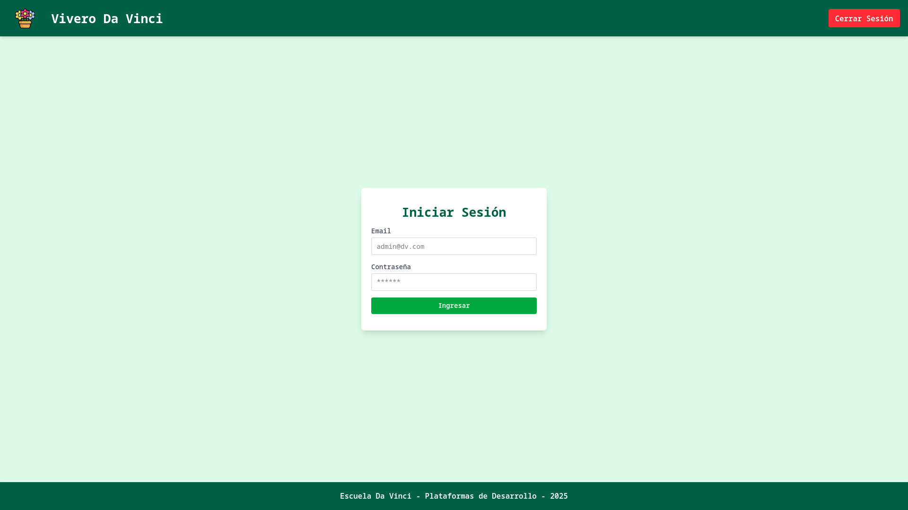

### Dashboard

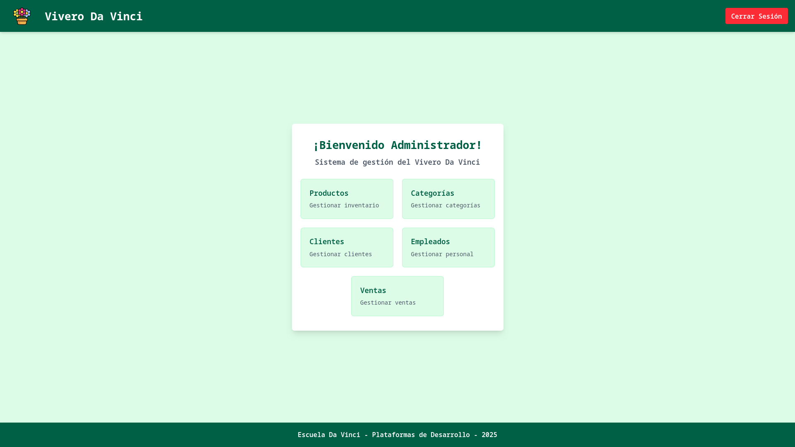

## Producto

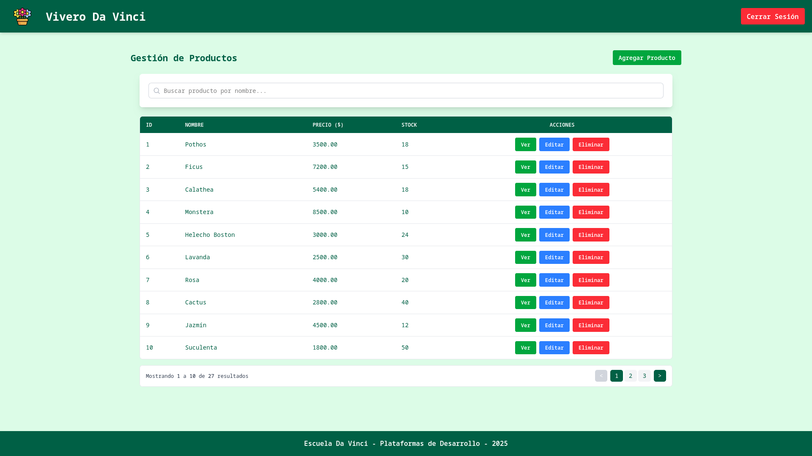

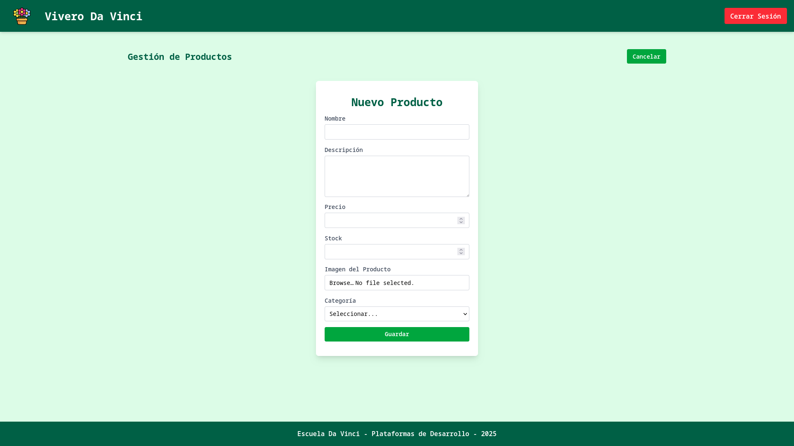

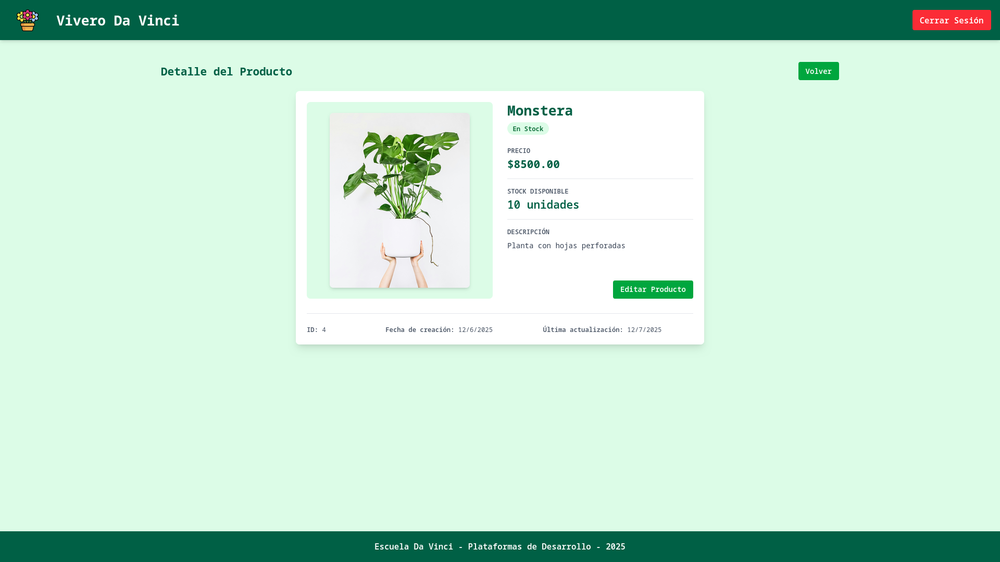

## Categoria

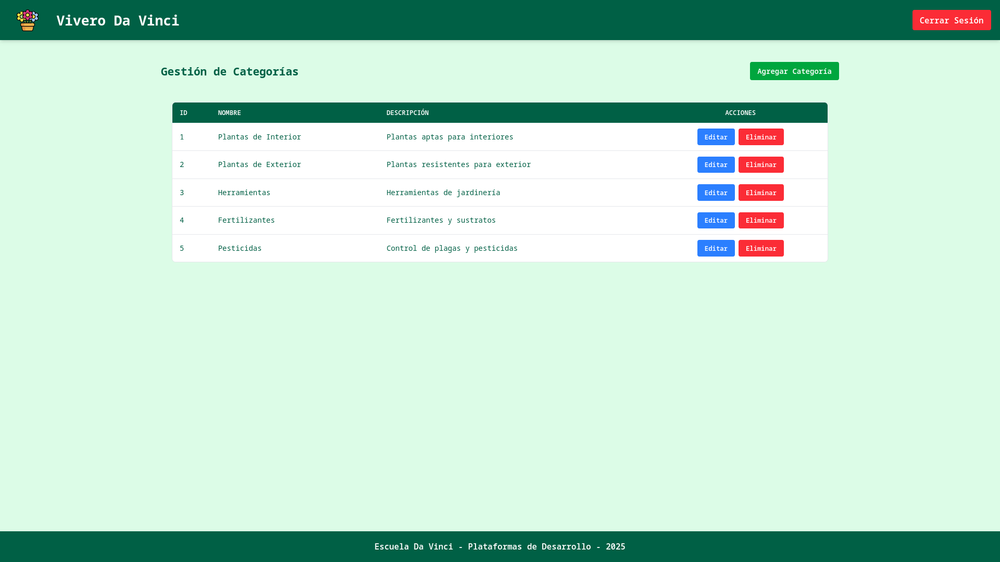

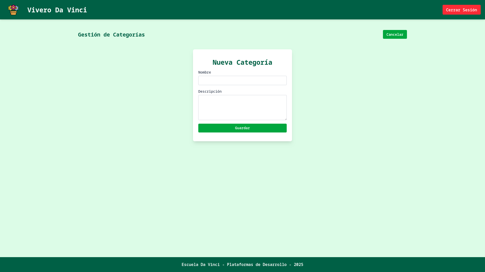

## Cliente

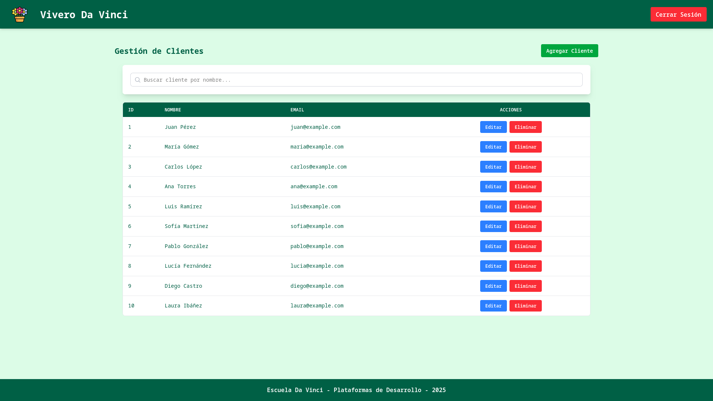

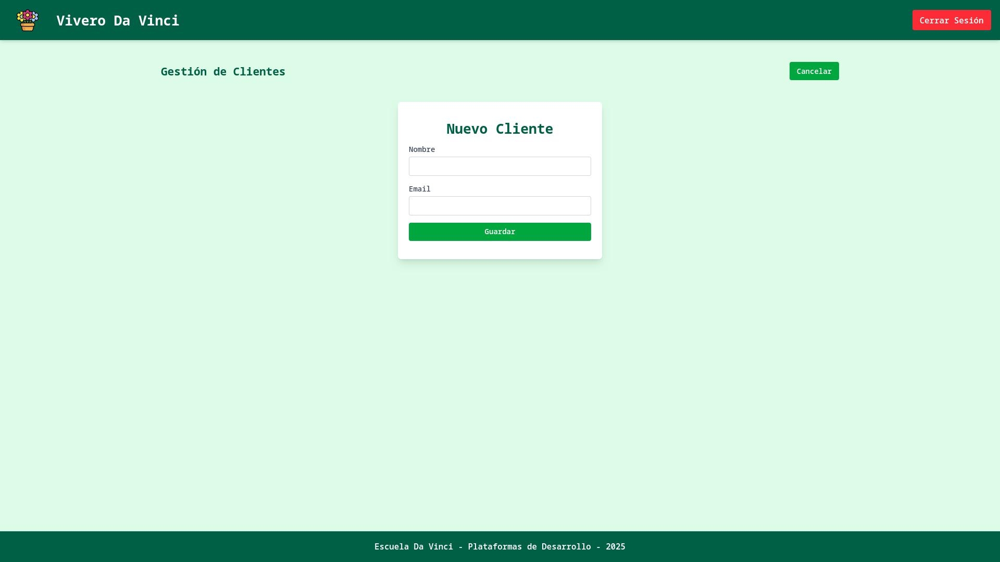

## Empleado

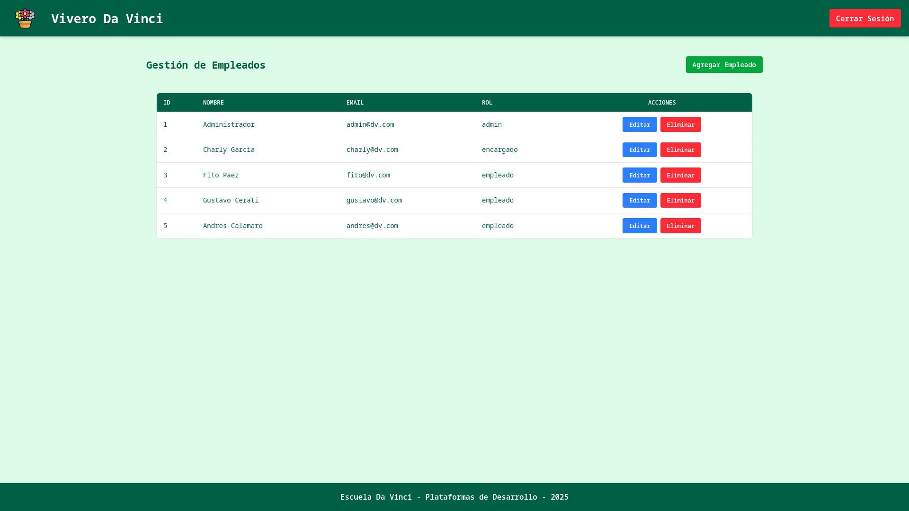

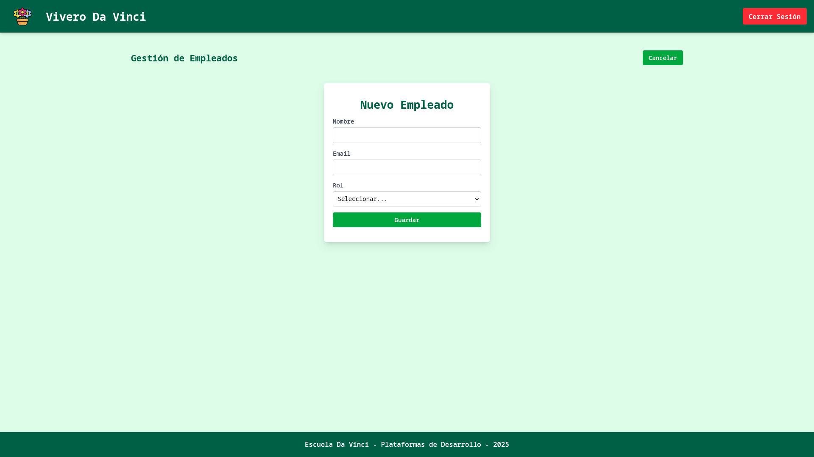

## Venta

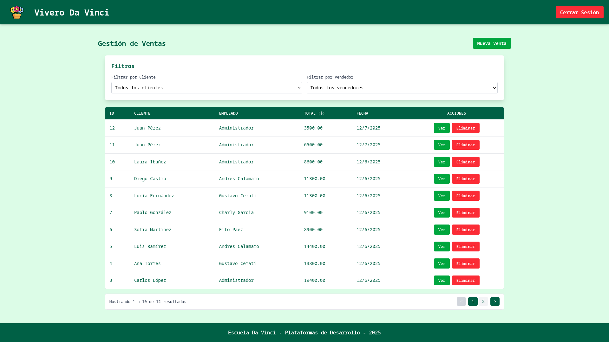

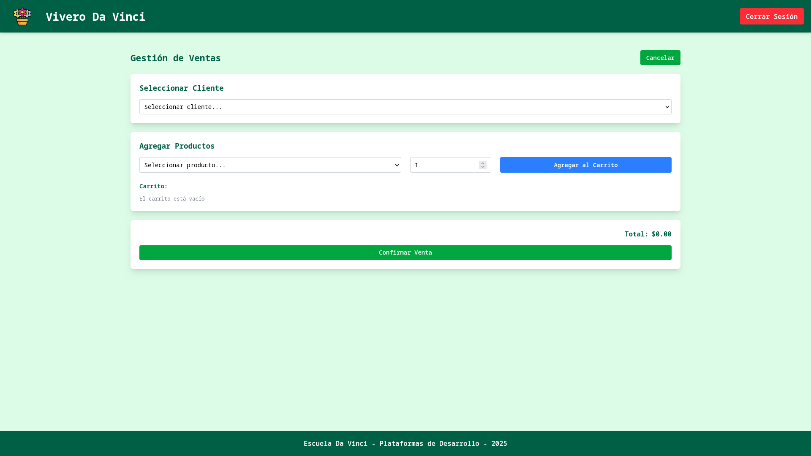

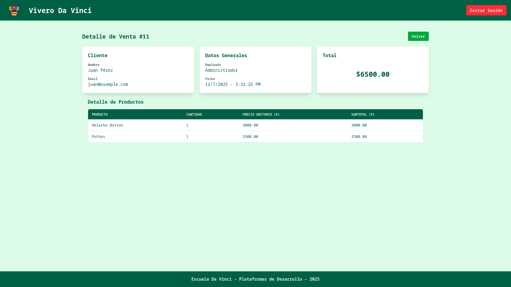
